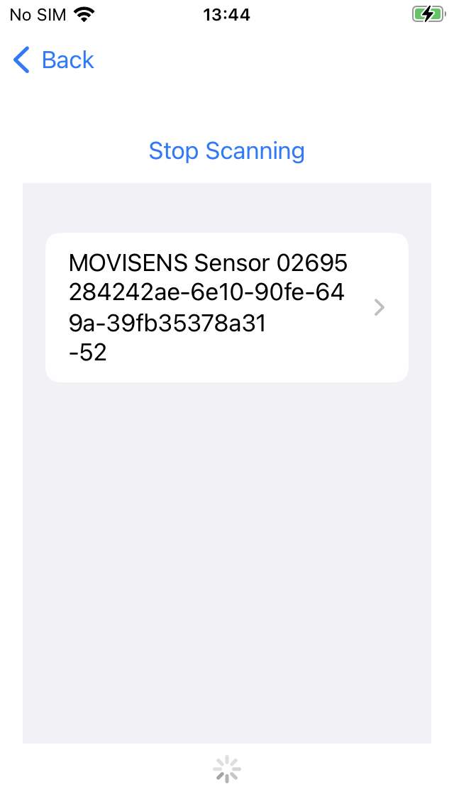
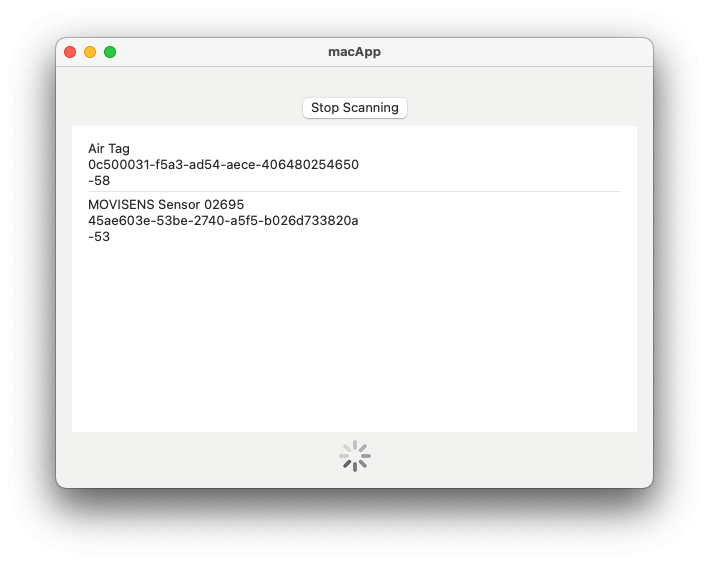
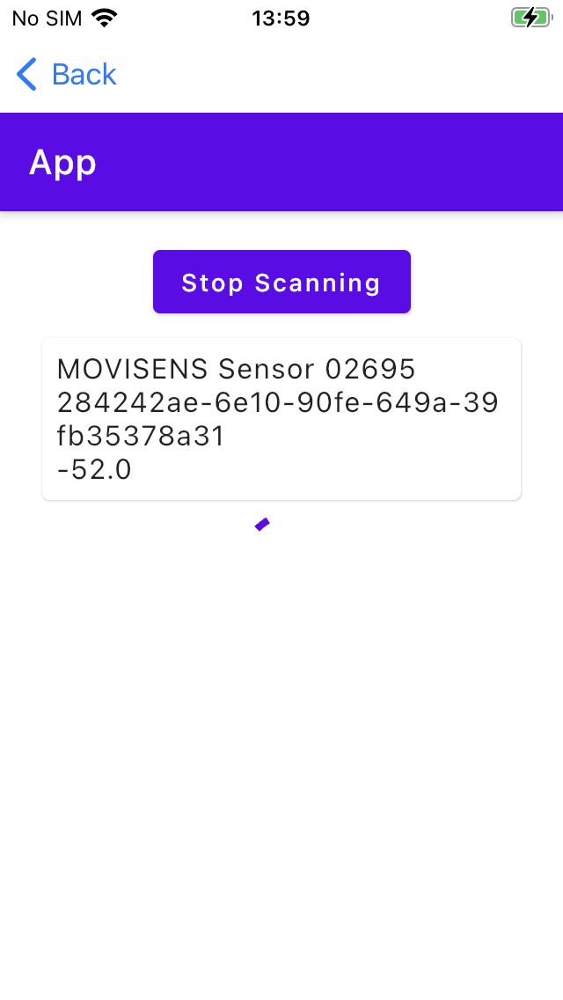
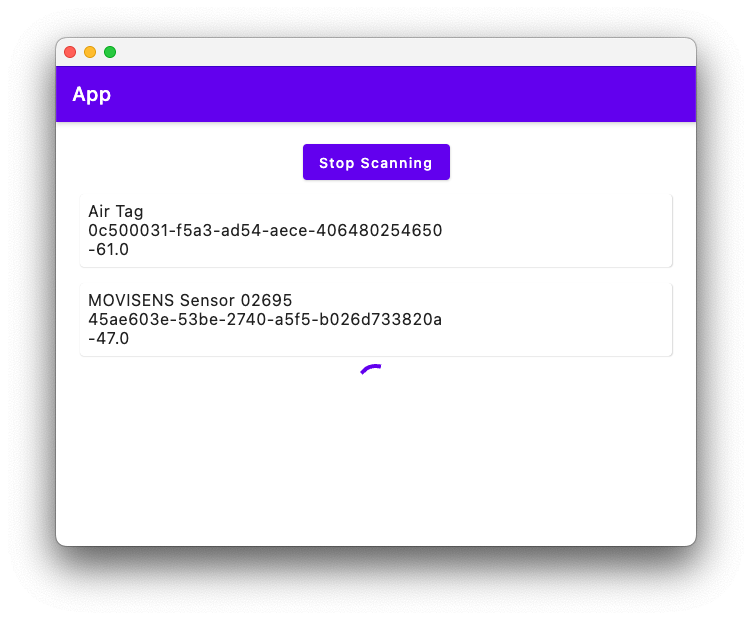

# Bluetooth Kotlin Multiplatform

Sample app to test Kotlin multiplatform and compose multiplatform capabilities in conjunction with using Bluetooth. Can check for movisens sensors and airtags. Reads movisens characteristics and tries to write sound characteristics of airtags to make them ring.

Uses [shared](shared/) and [sharedCompose](sharedCompose/) module in order to show the capabilities of Kotlin Multiplatform as well as Compose Multiplatform.

Forked from [Compose Multiplatform Sample](https://github.com/JetBrains/compose-multiplatform) on Github. Developed as preparation for "Kotlin Multiplatform - Code sharing einfach gemacht" and "Compose Multiplatform - code sharing einfach gemacht"

Still a work in progress, some features may not work on some platforms.

## Kotlin Multiplatform - Native UI

Android            |  iOS |  macOS
:-------------------------:|:-------------------------:|:-------------------------:
  |   |   

## Compose Multiplatform UI

Android            |  iOS |  macOS
:-------------------------:|:-------------------------:|:-------------------------:
  |   | 

## Building

### Android

Open the project in Android Studie and build the android project.

### iOS and macOS - SwiftUI

Open the iOS project in XCode and build the project. You have to change the Apple Developer account as well as the iOS bundle identifier. Use the corresponding target.

### macOS - Compose UI

Compose Multiplatform does currently not allow to mix ComposeUI and SwiftUI code. Therefore you have to build the ComposeUI variant via ```./gradlew runDebugExecutableMacosArm64```

## Troubleshooting

If you get a build error when building an iOS or MacOS SwiftUI app, you [may need to stop your gradle deamons](https://github.com/JetBrains/compose-multiplatform/issues/3829#issuecomment-1766415153).

## Resources

- [Get Started Guide - Kotlin Multiplatform](https://kotlinlang.org/docs/multiplatform-get-started.html)
- [Get Started Guide - Compose Multiplatform](https://www.jetbrains.com/help/kotlin-multiplatform-dev/compose-multiplatform-getting-started.html)
- [SKIE - Features](https://skie.touchlab.co/features/)
- [Awesome Kotlin Multiplatform](https://github.com/terrakok/kmp-awesome)
- [Kable](https://github.com/JuulLabs/kable)

## Licence

[Apache 2 Licence](LICENSE.txt)
